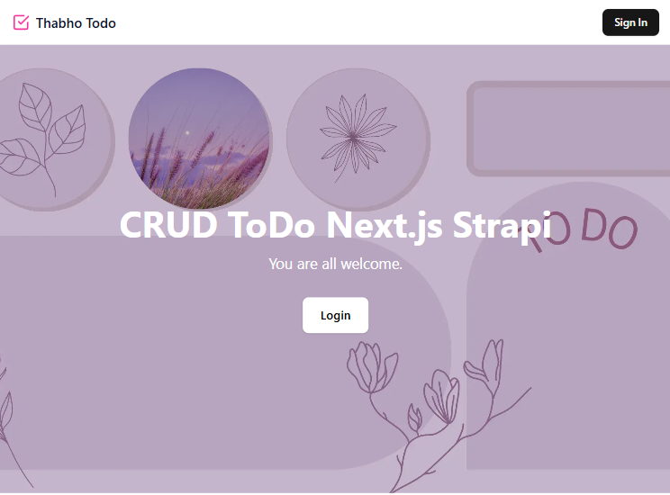
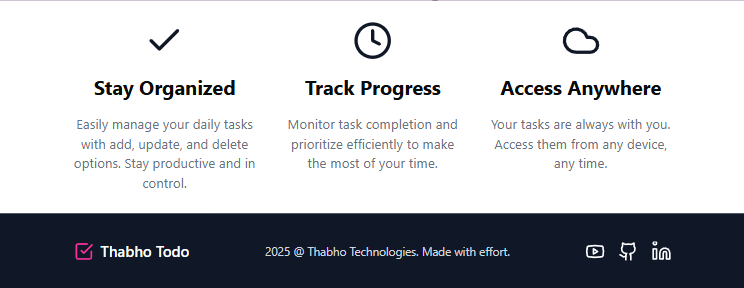
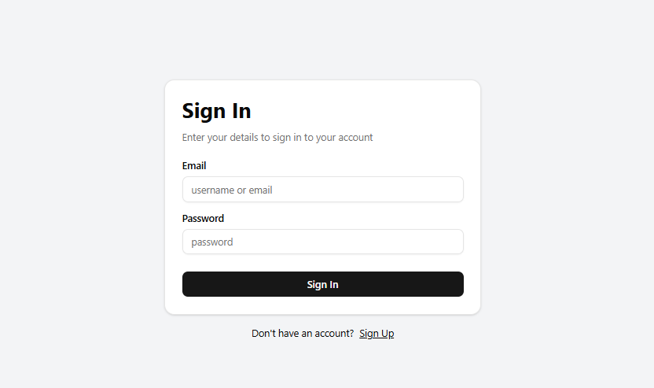
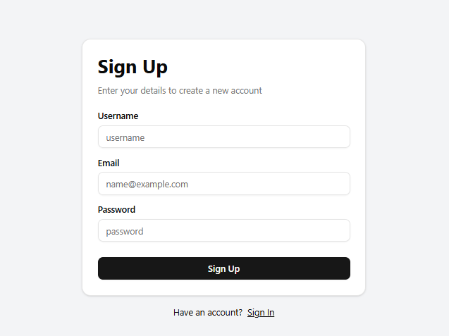
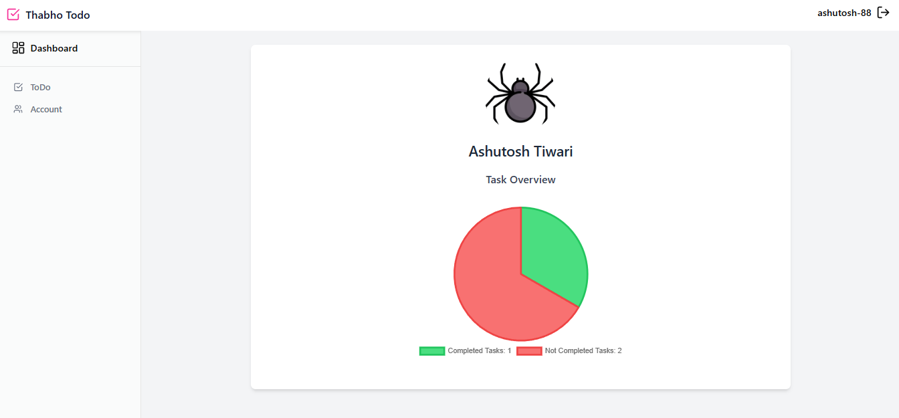
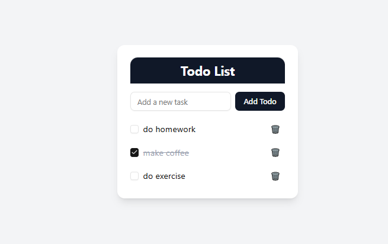
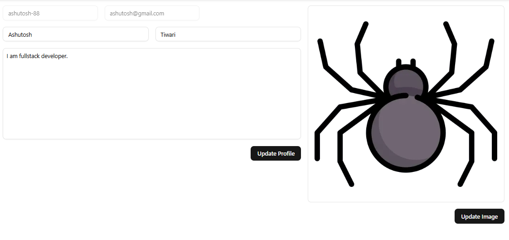

# 📝 Full-Stack Todo CRUD App

A full-featured Todo application built with:

- **Backend:** [Strapi](https://strapi.io/) (Node.js Headless CMS) + PostgreSQL
- **Frontend:** [Next.js](https://nextjs.org/) (with TypeScript), styled using [TailwindCSS](https://tailwindcss.com/) and [shadcn/ui](https://ui.shadcn.com/), and featuring charts using [Chart.js](https://www.chartjs.org/)

---

## 🚀 Features

### ✅ Backend (Strapi + PostgreSQL)

- Content types for Users and Todos
- JWT-based authentication (via Strapi Auth API)
- RESTful API endpoints
- PostgreSQL as the database
- Media upload (profile image)
- Role & permission management via Strapi admin UI

### ✅ Frontend (Next.js + TypeScript)

- Type-safe components and services (via TypeScript)
- Login and logout functionality with cookie-based JWT auth
- Protected routes using the new App Router with `use server`
- Full CRUD for Todos (Create, Read, Update, Delete)
- Profile image upload
- Dashboard with a visual breakdown of completed vs pending todos using Chart.js
- Sleek UI components from `shadcn/ui`
- Styled using TailwindCSS

---

## 📦 Project Structure

```yaml
/
├── backend        # Strapi backend (JavaScript, PostgreSQL)
└── frontend       # Next.js frontend (TypeScript, Tailwind, shadcn/ui)
```

---

## 🧰 Prerequisites

- Node.js (v18+)
- PostgreSQL (locally or via Docker)
- Yarn or npm
- Docker (optional but recommended)

---

## 🔧 Setup Instructions

### 1. Clone the Repo

```bash
git clone https://github.com/Ashutosh-88/crud-app.git

cd crud-app
```

### 2. Backend Setup (Strapi)

```bash
cd backend
cp .env.example .env
# Update with your PostgreSQL credentials

npm install
npm run develop
```

Strapi will open at http://localhost:1337/admin. Create your admin user.

**_Configure Content Types:_**

- **User (default)**

- **Todo**:
  - `text` (String)
  - `completed` (Boolean)
  - `user` (Relation: Many-to-One → User)

**_Enable Public API Permissions:_**

- Go to Settings → Roles → Public/Authenticated

- Enable access to necessary endpoints (find, create, update, etc.) for Todo

### 3. Frontend Setup (Next.js)

```bash
cd ../frontend
cp .env.local.example .env.local
# Add your STRAPI_API_URL and STRAPI_TOKEN if needed

# Install dependencies
npm install

# Run development server
npm run dev

```

App will run at http://localhost:3000

---

# Demo

### 🏠︎ Landing Page Preview

Includes a Header, Hero Section, Feature Section and Footer.




---

### 🔐 Sign In and Sign Up Preview

Includes a Sign In and Sign Up Form.





---

### 📊 Dashboard Preview

Includes a chart comparing Completed vs Pending todos using Chart.js.



---

### 📝 ToDo Preview

Includes a ToDo CRUD feature to add, read added todos, mark as completed and delete.



---

### 👨‍💼 Account Preview

Includes a form to update Account information.



---

# 📚 Tech Stack

| Area     | Tech                        |
| -------- | --------------------------- |
| Frontend | Next.js, TypeScript         |
| Styling  | TailwindCSS, shadcn/ui      |
| Charts   | Chart.js                    |
| Backend  | Strapi (REST API)           |
| Database | PostgreSQL                  |
| Auth     | JWT (Strapi Authentication) |

---

# 🧪 Todo Progress

- ✅ Strapi backend with PostgreSQL

- ✅ RESTful API setup

- ✅ Login/logout

- ✅ Profile image upload

- ✅ CRUD functionality for todos

- ✅ Task analytics with Chart.js

- ⬜ Filters and search

- ⬜ Improved mobile UI

<!-- ---

# 📄 License

MIT License -->

---

# 👤 Author

Developed by **Ashutosh-88**

---
